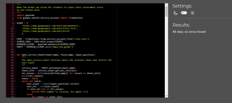

<h1>Make The Grade</h1>

* [Live project link](https://make-the-grade.herokuapp.com/)

* [Repository Link](https://github.com/fatimamahate/make_the_grade)

Make The Grade is an application useful for students and teachers. Students (or users as in the code) can input their target grade and scores for the latest assessment. Make The Grade is designed so that students input their scores as soon as they recieve them. It allows users to look through the grades throughout the year and means they no longer have to find exam papers since all scores will be inputted. 

Make The Grade is primarily for UK users, based on have 3 terms in the year and each term split in half. Each half-term may have an assessment. This can be manually changed in the Google Sheet. 

Teachers can also benefit, since it will reduce their workload since students are responsible for submitting scores. Students will have an overview of the assessments they have completed and can encourage students to work towards their target. The application will also encourage a sense of responsibility since grades cannot be changed by the student themselves. 

Teachers receive a School ID which is unique to that particular school. The School ID can be shared with students along with their own unique User ID. Both the School ID and User ID are meant to be kept secret so only those who schools who have 'subscribed' to the Make The Grade service can access it. Furthermore, this ensures data cannot be mixed about and people who are not 'subscribers' of the service cannot access the service with random numbers. 

All of the data regarding each student- as well as each school is stored in Google Sheets. 

## Contents

 * User Experience
* Pre-requisites
 * Features
 * Design
 * Technologies Used
 * Testing
 * Deployment
 * Credits
 * Acknowledgements

## User Experience
Users of the application should be able to:

* Input correct, valid ID's
* Input target (if user hasn't already done so)
* Check what data is already in the database
* Input assessment data in a consecutive manner
* Find out if they have reached/exceeded target.

## Pre-requisites
* It is expected from the user that they will be aware of any ID's before they are able to essentially log in to use the system. 
* The 'log in' details as well as a link to the Make The Grade database can be found in the additional notes of submission form. 

## Features
1. It begins with a welcome message to user.
    1. Asks user for School ID - A thank you message pops up for correct id
    2. Asks user for User ID - A thank you message pops up for correct id and id for the user
    

        

2. If user has no target, the user is asked to input a target grade. This updates the datasheet also. 

3. User is then asked if they are adding an assessment score or if they are simply viewing the grades they have. 
    1. User clicks 1 - they would like to add a score
    2. User clicks 2 - they would like to view their data and data is shown
    

        

        

4. Data is shown -if user clicked 1, then user will be asked what assessment number it is. 

5. User is then asked what the grade is.

6. Then the grade is updated and the new data is shown. User is thanked for using the app.

    

7. If all six assessments are complete, user can see if they have exceeded/met/missed out on target. 

### Future
* It would be useful to add a feature which allows users to predict what they would achieve if they continued at the same grade.
* It would also be useful to show the user how much they will require to exceed the target by rounding their target up (like ceil()). 

## Design
* A very basic flowchart was used to see how the application could work. 

* As the design went on further, seemingly minor things were more important such as a space between print statements.

## Technologies Used
* [Python](https://www.python.org/)

## Testing
### Validation Testing
* Validation for PEP8 has passed and any errors have been rectified.

* Manual tests
    * The following images show the tests carried out

* The application was tested on both Google Chrome and Internet Edge without any faults.

## Deployment
### Clone a repository
* To clone a repository, go to the GitHub repository.
* Click on Code
* Copy the link
* Open GitBash
* Type in git clone, copy your URL and press enter.

### Deploy to Heroku
* Create login with Heroku
* Click on 'Create New App'
* Name your file- name must be unique
* Select the region that you are in
* Navigate to and click on the settings tab
* Navigate to the Config vars section of page.
* In the 'Key' Field, type CREDS
* Then copy requirments.txt file contents into Value field.
* Then click 'Add'
* Add another, with 'Key' field as PORT and the 'value' as 8000
* Click on 'Add buildpack"
* Select 'Python' and then save changes.
* Repeat last two steps but this time select node.js and then save changes
* Navigate to deply section at the top
* Select Github (if it is your first time using heroku you may need to verify your account by typing in your password.)
* Look for the github repository with the code
* Select automatic deploy

### Use the Google Sheets API
#### Creating a Google Sheet
* Visit [the Google Sheets](https://docs.google.com/spreadsheets/u/0/) website and if needed create an account
* Navigate and click on blank to create a blank worksheet
* Insert your data into the cells on the sheet

#### Google Drive API - to generate credentials
* Visit [the Google Cloud Platform](https://console.cloud.google.com/getting-started) website.
* If not already, create an account.
* Select 'Select a project'
* Select new project
* Name your porject
* Click 'Select Project'
* On the side, click on 'APIs and services' and then click on 'Library'
* Search for Google Drive in the search bar 
* Click on Google Drive API
* Click on 'Enable'
* Click on 'Create Credentials'
* For the following questions choose the answers that follow the question
1. Which API are you using?
Google Drive API
2. What data will you be accessing?
Application Data
3. Are you planning to use this API with Compute Engline, Kubernetes Engine, App Engine or Cloud Functions?
No, I am not using them
* Then click on 'Next'
* Type in a service account name - try the name of the project
* Click on 'create'
* In the role dropdown, select 'Basic' then 'Editor'
* Click 'continue'
* Then click 'done'
* In the 'Credentials' tab, navigate to the Service Account that is created
* Then click on 'Keys'
* Navigate and click on 'Add Key'
* Choose 'Create New Key'
* Select 'JSON' (recommended)
* Credentials are downloaded on your device.
* Copy file into your GitPod editor for this particular project
* Rename to creds.json
* In .gitignore add this file name

#### Google Sheets API
* On the same website as above
    * In the search bar, search for 'Google Sheets'
    * Select 'Google Sheets API'
    * Click on 'Enable'

## Credits
* In order to amend data for a specific student, I temporarily [deleted](https://itecnote.com/tecnote/python-how-to-delete-remove-row-from-the-google-spreadsheet-using-gspread-lib-in-python/) the row and rejoined at the end of the table with the new data.
* Love Sandwiches was also important to the understanding of this project.

## Acknowledgements
Thank you to my mentor, Brian Macharia, who provided invaluable, constructive feedback on this PP3 project. 
